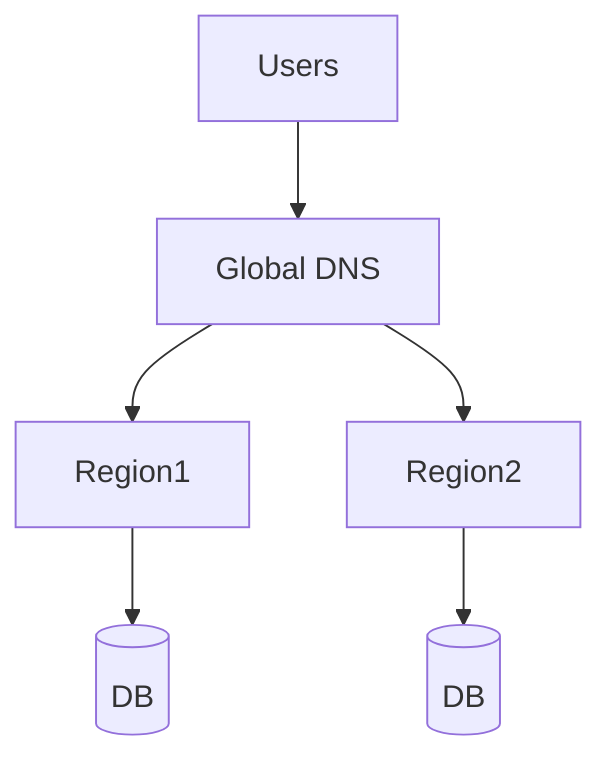

# Multi-Region Strategy

## Overview
Ensures high availability across regions.

## Approaches
- Active/Active → traffic split across regions.
- Active/Passive → failover to backup region.

## Tools
- Global DNS load balancing
- Cloud provider replication

## Diagram

