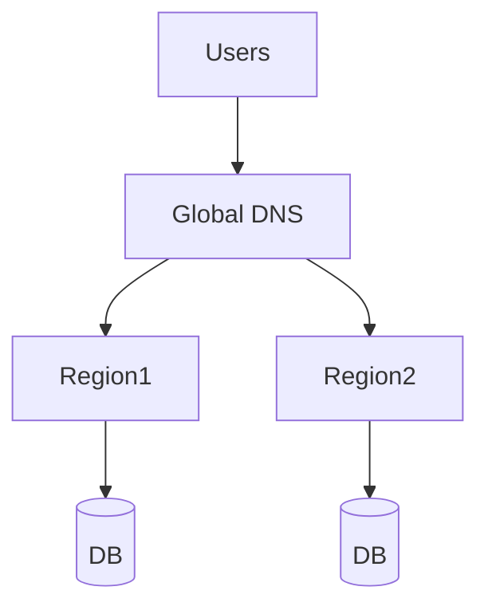

# Multi-Region Strategy

## Overview
- This section outlines the primary goals and scope of Multi Region.

## Prerequisites
- Familiarity with basic Multi Region concepts and system requirements is recommended.

## Setup
- Follow these steps to configure and enable Multi Region in your environment.

## Usage
- Instructions and examples for applying Multi Region in day-to-day operations.

## References
- Additional resources and documentation about Multi Region for further learning.

## Overview
Ensures high availability across regions.

## Approaches
- Active/Active → traffic split across regions.
- Active/Passive → failover to backup region.

## Tools
- Global DNS load balancing
- Cloud provider replication

## Diagram

## Related Docs
- [README.md](README.md)
- [MASTER_INDEX.md](MASTER_INDEX.md)

