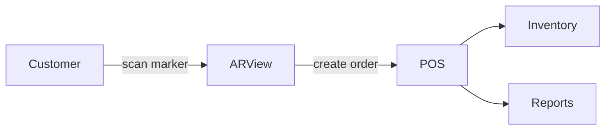

# ARVRMenu Module

## Overview
Provides augmented and virtual reality interfaces for browsing the menu and placing orders.

## Features
- Render 3D menu items using WebXR.
- Real-time price and availability updates through EventBus.
- Supports marker-based AR and VR headsets.

## Dependencies
- Core
- Inventory
- POS

## Workflows

Describes key data flows.

## API
- `GET /api/arvrmenu/menu` – Retrieve AR-ready menu data.
- `POST /api/arvrmenu/orders` – Submit an order from the AR/VR interface.

## Examples
```js
fetch('/api/arvrmenu/menu')
  .then(r => r.json())
  .then(menu => console.log(menu))
```

## UI/UX
- [resources/js/Modules/QrOrdering](../resources/js/Modules/QrOrdering)

## Action Plan
- Integrate WebXR device API (see issue #201).
- Add end-to-end tests with Playwright (issue #202).

## Future Enhancements
- AI-driven menu recommendations.
