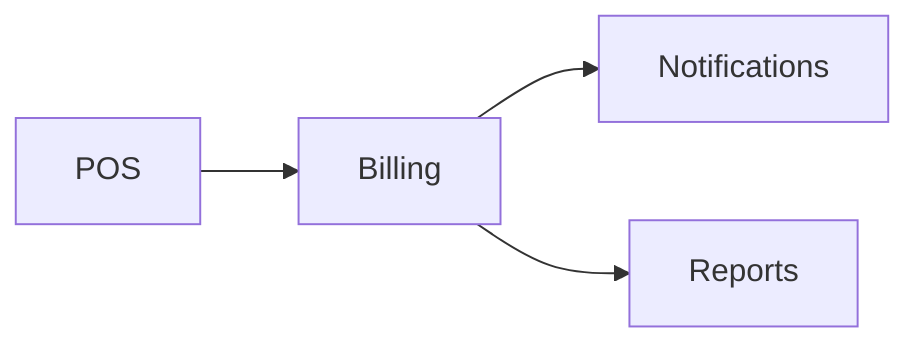

# Billing Module

## Overview
Manages subscriptions, invoices, and payment processing for tenants.

## Features
- Supports Stripe and Paddle payment gateways.
- Generates invoices and handles refunds.
- Multi-currency and tax rate configuration.

## Dependencies
- Core
- Notifications

## Workflows

Describes key data flows.

## API
- `GET /api/billing/invoices` – List invoices for the current tenant.
- `POST /api/billing/subscribe` – Create a subscription for a plan.

## Examples
```bash
curl -X POST /api/billing/subscribe -d 'plan_id=1'
```

## UI/UX
- [resources/js/Modules/Billing](../resources/js/Modules/Billing)

## Action Plan
- Implement webhook handling for payment events (issue #203).
- Add Pest unit tests for subscription logic (issue #204).

## Future Enhancements
- Usage-based billing support.
