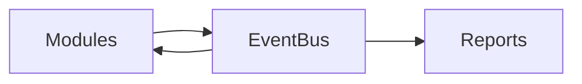

# Core Module

## Overview
Provides tenancy, RBAC, feature flags, and the central event bus.

## Features
- Multi-tenant database isolation.
- Role-based access control using Spatie permissions.
- Event bus for cross-module communication.

## Dependencies


## Workflows

Describes key data flows.

## API
- `POST /api/core/events` – Publish an internal event.

## Examples
```php
Event::dispatch(new ModuleEvent('inventory.updated'))
```

## UI/UX
- [resources/js/Modules/Core](../resources/js/Modules/Core)

## Action Plan
- Document multi-tenant setup guide (issue #205).

## Future Enhancements
- Service mesh integration.
