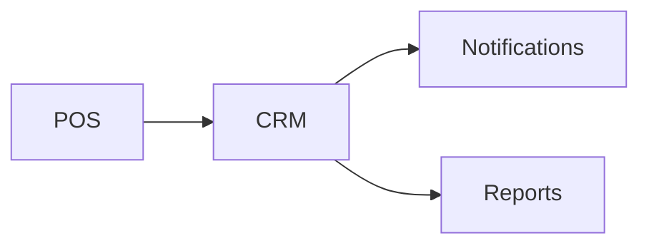

# CRM Module

## Overview
Tracks customer profiles, feedback, and segmentation for targeted marketing.

## Features
- Customer profile management with notes and tags.
- Survey and feedback collection.
- Segmentation for campaigns and loyalty programs.

## Dependencies
- Core
- Loyalty
- Notifications

## Workflows

Describes key data flows.

## API
- `GET /api/crm/customers` – List customer profiles.
- `POST /api/crm/segments` – Create a new marketing segment.

## Examples
```bash
curl /api/crm/customers?segment=vip
```

## UI/UX
- [resources/js/Modules/Crm](../resources/js/Modules/Crm)

## Action Plan
- Implement GDPR export tools (issue #206).

## Future Enhancements
- Predictive churn analysis.
