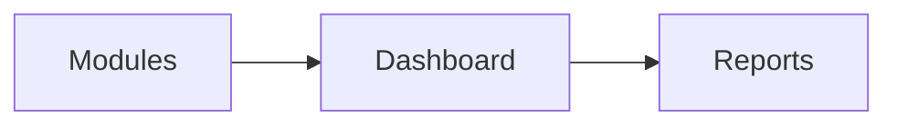

# Dashboard Module

## Overview
Displays KPIs and operational metrics across modules for managers.

## Features
- Real-time sales, inventory, and staffing widgets.
- Configurable layouts per tenant.
- Drill-down reports and export options.

## Dependencies
- Core
- Reports

## Workflows

Describes key data flows.

## API
- `GET /api/dashboard/metrics` – Fetch aggregated KPI metrics.

## Examples
```js
const metrics = await axios.get('/api/dashboard/metrics');
```

## UI/UX
- [resources/js/Modules/SuperAdmin](../resources/js/Modules/SuperAdmin)

## Action Plan
- Add customizable widget library (issue #207).

## Future Enhancements
- Mobile dashboard app.
