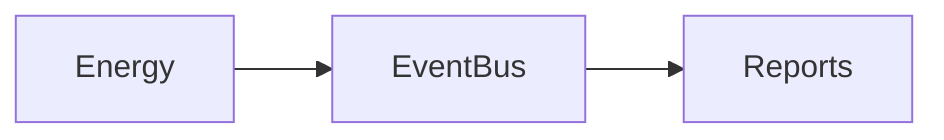

# Energy Module

## Overview
Energy consumption tracking & alerts.

## Features
- Core functional features of Energy.
- Integration with other CafeOS modules.
- i18n/RTL and multi-currency ready.

## Dependencies
- Depends on: Core (tenancy, RBAC, EventBus).
- May require: Billing, Inventory, Notifications.

## Workflows

- Example workflow for Energy.

## UI/UX
- Interfaces: dashboards, CRUD screens, forms.
- POS/KDS integration if applicable.
- Mobile-first responsive layouts.

## Missing Items
- [ ] Add automated tests for Energy.
- [ ] Add REST/GraphQL endpoints.
- [ ] Add Blade components with namespace.
- [ ] Production-grade validations.

## Future Enhancements
- Extend Energy with AI-driven analytics and marketplace hooks.
