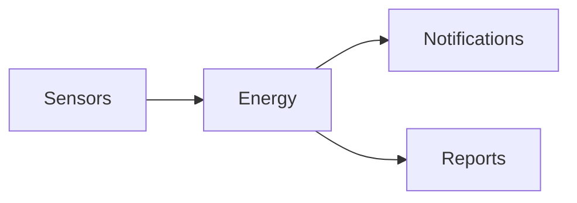

# Energy Module

## Overview
Monitors energy consumption and generates alerts for abnormal usage.

## Features
- Collects meter readings from IoT devices.
- Compares usage against benchmarks.
- Sends notifications when thresholds are exceeded.

## Dependencies
- Core
- Notifications

## Workflows

Describes key data flows.

## API
- `POST /api/energy/readings` – Submit a new energy reading.

## Examples
```bash
curl -X POST /api/energy/readings -d 'kwh=15'
```

## UI/UX
- [resources/js/Modules](../resources/js/Modules)

## Action Plan
- Design Vue components for energy charts (issue #208).

## Future Enhancements
- Carbon footprint analytics.
