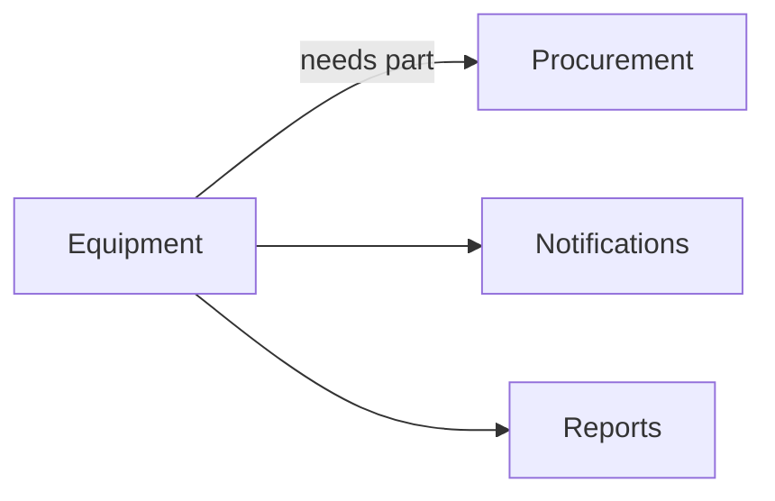

# Equipment Module

## Overview
Keeps track of equipment status, maintenance schedules, and warranties.

## Features
- Maintenance ticketing and reminders.
- Warranty and depreciation tracking.
- Integration with procurement for parts ordering.

## Dependencies
- Core
- Procurement
- Notifications

## Workflows

Describes key data flows.

## API
- `GET /api/equipment` – List equipment with status.

## Examples
```php
$response = Http::get('/api/equipment');
```

## UI/UX
- [resources/js/Modules/EquipmentMaintenance](../resources/js/Modules/EquipmentMaintenance)

## Action Plan
- Add QR code scanning for equipment IDs (issue #209).

## Future Enhancements
- Predictive maintenance via ML.
