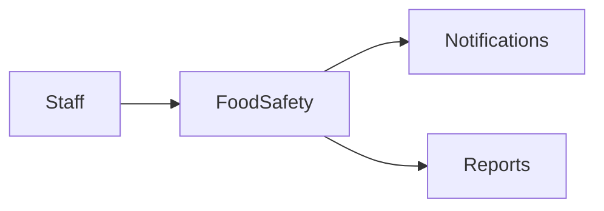

# FoodSafety Module

## Overview
Ensures compliance with food safety regulations and HACCP checklists.

## Features
- Temperature log recording.
- Scheduled sanitation checklists.
- Audit trail with photo attachments.

## Dependencies
- Core
- Notifications

## Workflows

Describes key data flows.

## API
- `POST /api/foodsafety/logs` – Store a temperature log entry.

## Examples
```bash
curl -F photo=@fridge.jpg /api/foodsafety/logs
```

## UI/UX
- [resources/js/Modules](../resources/js/Modules)

## Action Plan
- Implement photo annotation tools (issue #210).

## Future Enhancements
- Automated sensor integration.
