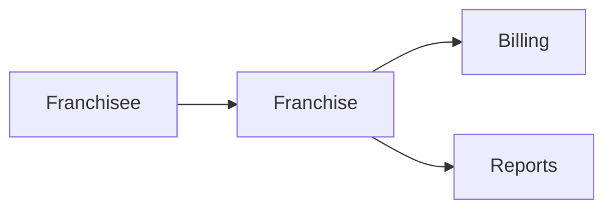

# Franchise Module

## Overview
Manages franchisee information, royalties, and compliance documents.

## Features
- Franchisee onboarding and contract management.
- Royalty calculation and invoicing.
- Compliance document repository.

## Dependencies
- Core
- Billing
- Reports

## Workflows

Describes key data flows.

## API
- `GET /api/franchise/locations` – List franchise locations.

## Examples
```bash
curl /api/franchise/locations
```

## UI/UX
- [resources/js/Modules](../resources/js/Modules)

## Action Plan
- Automate royalty statements (issue #211).

## Future Enhancements
- Franchisee portal.
