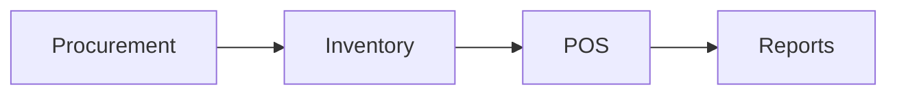

# Inventory Module

## Overview
Tracks stock levels, batches, and reorder workflows across locations.

## Features
- SKU and batch tracking with expirations.
- Automatic reorder triggers.
- Stock movement auditing.

## Dependencies
- Core
- Procurement
- POS

## Workflows

Describes key data flows.

## API
- `GET /api/inventory/items` – Retrieve inventory items.
- `POST /api/inventory/adjust` – Adjust stock levels.

## Examples
```bash
curl -X POST /api/inventory/adjust -d 'sku=123&qty=-1'
```

## UI/UX
- [resources/js/Modules/Inventory](../resources/js/Modules/Inventory)

## Action Plan
- Add barcode scanning support (issue #212).

## Future Enhancements
- Supplier lead-time forecasting.
