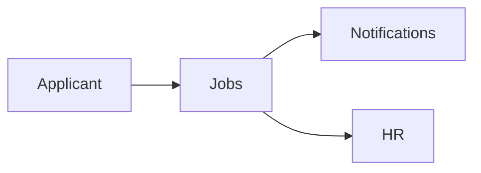

# Jobs Module

## Overview
Handles job postings, applications, and internal shifts.

## Features
- Publish open positions and accept applications.
- Shift scheduling and assignment.
- Employee onboarding checklists.

## Dependencies
- Core
- Notifications

## Workflows

Describes key data flows.

## API
- `POST /api/jobs/applications` – Submit a job application.

## Examples
```bash
curl -X POST /api/jobs/applications -d 'job_id=5'
```

## UI/UX
- [resources/js/Modules/Jobs](../resources/js/Modules/Jobs)
- [resources/js/Modules/HrJobs](../resources/js/Modules/HrJobs)

## Action Plan
- Integrate with external job boards (issue #213).

## Future Enhancements
- Automated interview scheduling.
