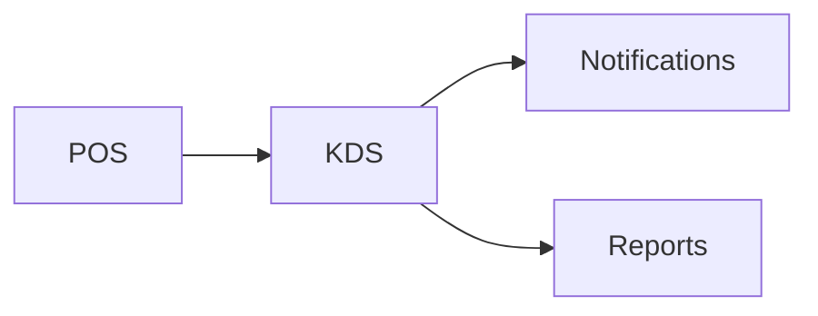

# KDS Module

## Overview
Kitchen display system for managing and prioritizing orders.

## Features
- Real-time order queue from POS.
- Color-coded prep timers.
- Bump and recall actions.

## Dependencies
- Core
- POS
- Notifications

## Workflows

Describes key data flows.

## API
- `GET /api/kds/orders` – Get open kitchen orders.

## Examples
```js
const orders = await fetch('/api/kds/orders').then(r=>r.json());
```

## UI/UX
- [resources/js/Modules/Kds](../resources/js/Modules/Kds)

## Action Plan
- Add touchscreen gesture support (issue #214).

## Future Enhancements
- Voice-controlled updates.
