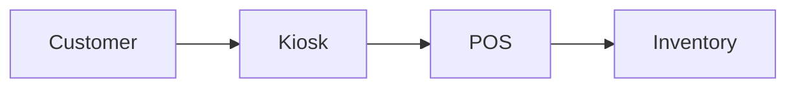

# Kiosk Module

## Overview
Self-service ordering kiosk for in-store customers.

## Features
- Customizable menu layouts.
- Support for cashless payments.
- Order status display with QR receipts.

## Dependencies
- Core
- POS
- Inventory

## Workflows

Describes key data flows.

## API
- `POST /api/kiosk/orders` – Create order from kiosk.

## Examples
```bash
curl -X POST /api/kiosk/orders -d 'item_id=1'
```

## UI/UX
- [resources/js/Modules/QrOrdering](../resources/js/Modules/QrOrdering)

## Action Plan
- Implement accessibility features (issue #215).

## Future Enhancements
- Facial recognition for loyalty lookup.
