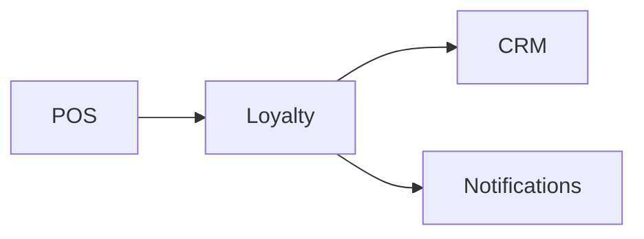

# Loyalty Module

## Overview
Awards points and manages reward redemption for returning customers.

## Features
- Point accrual rules per product or spend.
- Reward catalog and redemption tracking.
- Integration with CRM for targeted offers.

## Dependencies
- Core
- CRM
- Notifications

## Workflows

Describes key data flows.

## API
- `GET /api/loyalty/points` – Fetch loyalty points for current user.

## Examples
```bash
curl /api/loyalty/points
```

## UI/UX
- [resources/js/Modules/Loyalty](../resources/js/Modules/Loyalty)

## Action Plan
- Add tiered loyalty levels (issue #216).

## Future Enhancements
- Partner reward network.
