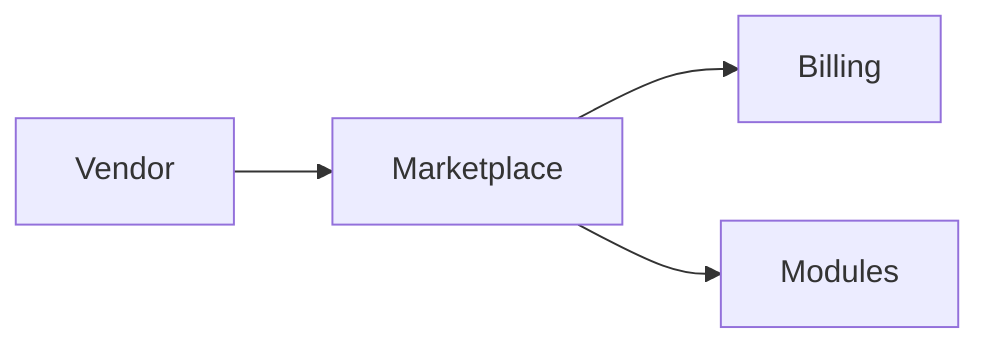

# Marketplace Module

## Overview
Connects cafes with third-party vendors for supplies and integrations.

## Features
- Vendor listing and rating.
- Plugin marketplace with one-click installs.
- Revenue sharing and billing integration.

## Dependencies
- Core
- Billing

## Workflows

Describes key data flows.

## API
- `GET /api/marketplace/vendors` – List available vendors.

## Examples
```bash
curl /api/marketplace/vendors
```

## UI/UX
- [resources/js/Modules/Marketplace](../resources/js/Modules/Marketplace)

## Action Plan
- Implement vendor onboarding flow (issue #217).

## Future Enhancements
- In-app purchases.
