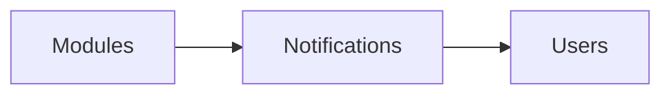

# Notifications Module

## Overview
Delivers email, SMS, and push notifications triggered by module events.

## Features
- Configurable channels per tenant.
- Template management with localization.
- Digest and real-time delivery modes.

## Dependencies
- Core

## Workflows

Describes key data flows.

## API
- `POST /api/notifications/test` – Send a test notification.

## Examples
```php
Notification::route('mail', 'user@example.com')->notify(new InvoicePaid());
```

## UI/UX
- [resources/js/Modules/Notifications](../resources/js/Modules/Notifications)

## Action Plan
- Add preference center UI (issue #218).

## Future Enhancements
- AI-optimized send times.
