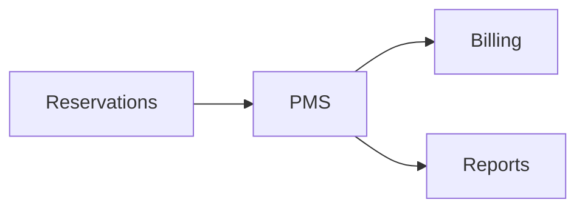

# PMS Module

## Overview
Property management system for managing rooms and bookings.

## Features
- Room inventory and status management.
- Billing integration for stays.
- Guest communication tools.

## Dependencies
- Core
- Billing
- Reservations

## Workflows

Describes key data flows.

## API
- `GET /api/pms/rooms` – List rooms and availability.

## Examples
```bash
curl /api/pms/rooms?status=vacant
```

## UI/UX
- [resources/js/Modules](../resources/js/Modules)

## Action Plan
- Integrate with channel managers (issue #219).

## Future Enhancements
- Smart lock integration.
