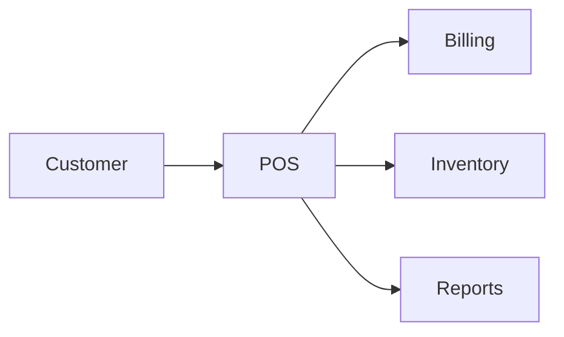

# POS Module

## Overview
Point of sale for processing orders, payments, and receipts.

## Features
- Supports dine-in, take-out, and delivery orders.
- Handles discounts, tips, and tax calculations.
- Synchronizes with inventory in real time.

## Dependencies
- Core
- Billing
- Inventory

## Workflows

Describes key data flows.

## API
- `POST /api/pos/orders` – Create a new order.

## Examples
```js
await axios.post('/api/pos/orders', {items: [...]});
```

## UI/UX
- [resources/js/Modules/Pos](../resources/js/Modules/Pos)
- [resources/js/Pages/Pos](../resources/js/Pages/Pos)

## Action Plan
- Add offline mode with service workers (issue #220).

## Future Enhancements
- Self-checkout mode.
