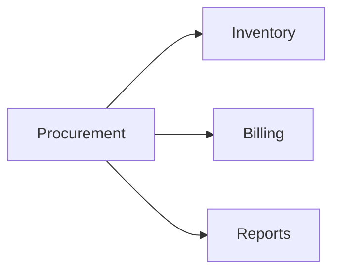

# Procurement Module

## Overview
Handles supplier management, purchase orders, and stock intake.

## Features
- Supplier directory with contract terms.
- Purchase order lifecycle management.
- Stock intake and reconciliation.

## Dependencies
- Core
- Inventory
- Billing

## Workflows

Describes key data flows.

## API
- `POST /api/procurement/purchase-orders` – Create a new purchase order.

## Examples
```bash
curl -X POST /api/procurement/purchase-orders -d 'supplier_id=3'
```

## UI/UX
- [resources/js/Modules/Procurement](../resources/js/Modules/Procurement)

## Action Plan
- Automate vendor performance reports (issue #221).

## Future Enhancements
- EDI integration.
