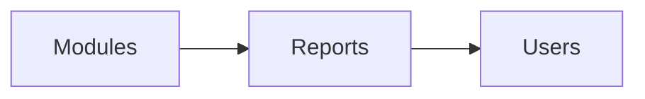

# Reports Module

## Overview
Generates analytics, KPIs, and forecasting tools across modules.

## Features
- Pre-built sales and inventory reports.
- Custom report builder with export options.
- Scheduled report delivery.

## Dependencies
- Core

## Workflows

Describes key data flows.

## API
- `GET /api/reports/sales` – Retrieve sales report data.

## Examples
```bash
curl /api/reports/sales?range=30d
```

## UI/UX
- [resources/js/Modules/Reports](../resources/js/Modules/Reports)

## Action Plan
- Implement drag-and-drop report builder (issue #222).

## Future Enhancements
- Predictive analytics.
