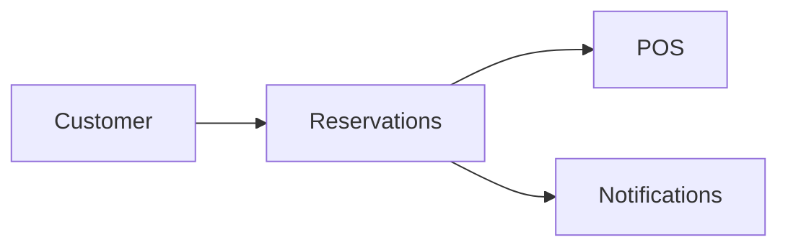

# Reservations Module

## Overview
Manages table bookings and waitlists for dine-in customers.

## Features
- Online booking with confirmation messages.
- Waitlist management and seat allocation.
- Integration with POS for order linking.

## Dependencies
- Core
- POS
- Notifications

## Workflows

Describes key data flows.

## API
- `POST /api/reservations` – Create a new reservation.

## Examples
```bash
curl -X POST /api/reservations -d 'time=19:00&guests=4'
```

## UI/UX
- [resources/js/Modules/TableReservations](../resources/js/Modules/TableReservations)

## Action Plan
- Add floor plan drag-and-drop (issue #223).

## Future Enhancements
- Integration with Google Reservations.
