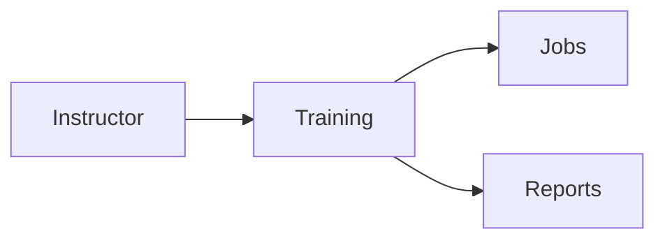

# Training Module

## Overview
Provides employee onboarding courses and tracks completion.

## Features
- Course builder with quizzes.
- Progress tracking and certificates.
- Integration with Jobs module for new hires.

## Dependencies
- Core
- Jobs

## Workflows

Describes key data flows.

## API
- `GET /api/training/courses` – List available courses.

## Examples
```bash
curl /api/training/courses
```

## UI/UX
- [resources/js/Modules](../resources/js/Modules)

## Action Plan
- Upload video lessons to CDN (issue #224).

## Future Enhancements
- Adaptive learning paths.
