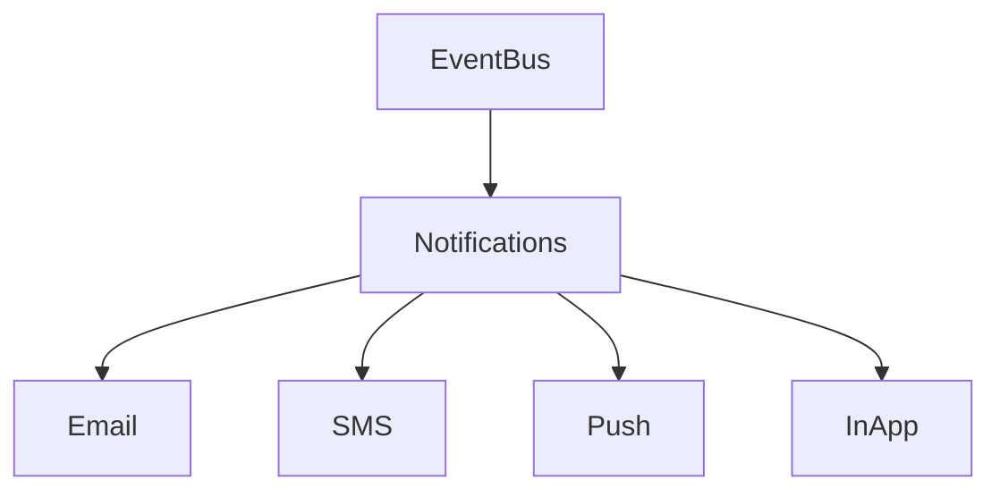

# Notifications

## Overview
- This section outlines the primary goals and scope of Notifications.

## Prerequisites
- Familiarity with basic Notifications concepts and system requirements is recommended.

## Setup
- Follow these steps to configure and enable Notifications in your environment.

## Usage
- Instructions and examples for applying Notifications in day-to-day operations.

## References
- Additional resources and documentation about Notifications for further learning.

## Overview
Manages delivery of notifications across channels.

## Channels
- Email
- SMS (Twilio)
- Push Notifications (PWA)
- In-App Alerts

## Flow

