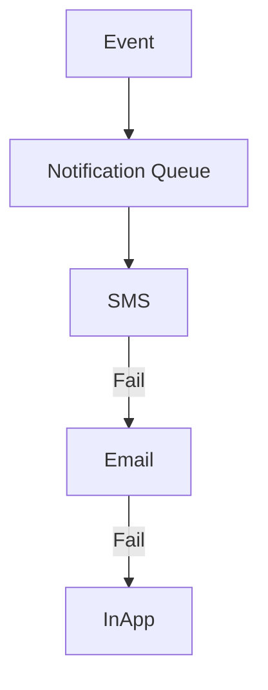

# Notification Rules

## Overview
- TBD

## Prerequisites
- TBD

## Setup
- TBD

## Usage
- TBD

## References
- TBD

## Overview
Defines rules for notification priority, retry, and failover.

## Queue Priorities
- High → Critical alerts (system outage, payment failure)
- Medium → Order updates, reservations
- Low → Marketing emails

## Retry Strategy
- SMS fail → fallback to Email
- Push fail → fallback to In-App

## Diagram

