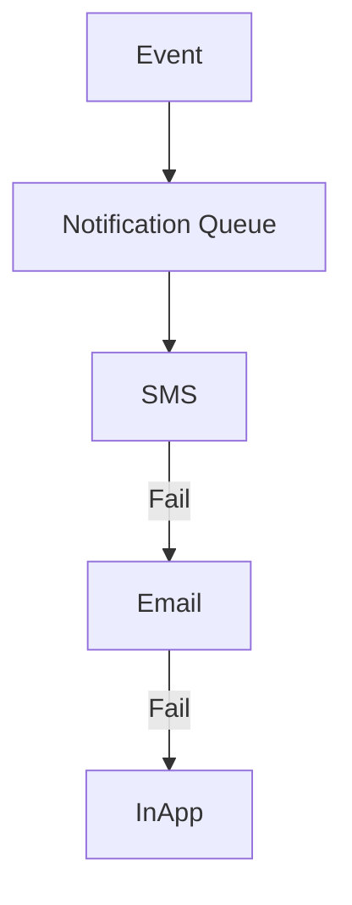

# Notification Rules

## Overview
- This section outlines the primary goals and scope of Notification Rules.

## Prerequisites
- Familiarity with basic Notification Rules concepts and system requirements is recommended.

## Setup
- Follow these steps to configure and enable Notification Rules in your environment.

## Usage
- Instructions and examples for applying Notification Rules in day-to-day operations.

## References
- Additional resources and documentation about Notification Rules for further learning.

## Overview
Defines rules for notification priority, retry, and failover.

## Queue Priorities
- High → Critical alerts (system outage, payment failure)
- Medium → Order updates, reservations
- Low → Marketing emails

## Retry Strategy
- SMS fail → fallback to Email
- Push fail → fallback to In-App

## Diagram

