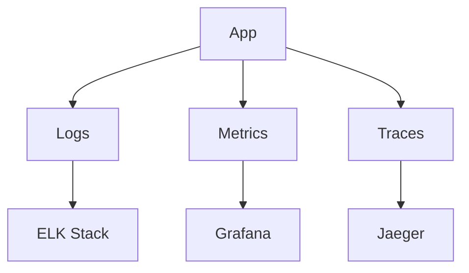

# Observability

## Overview
- This section outlines the primary goals and scope of Observability.

## Prerequisites
- Familiarity with basic Observability concepts and system requirements is recommended.

## Setup
- Follow these steps to configure and enable Observability in your environment.

## Usage
- Instructions and examples for applying Observability in day-to-day operations.

## References
- Additional resources and documentation about Observability for further learning.

## Overview
Ensures deep visibility across services using logs, metrics, and traces.

## Components
- **Logs** → ELK Stack
- **Metrics** → Prometheus + Grafana
- **Tracing** → OpenTelemetry + Jaeger

## Flow

## See Also
- [Monitoring & Alerting Guide](MONITORING.md)
- [Monitoring Flow](MONITORING_FLOW.md)
