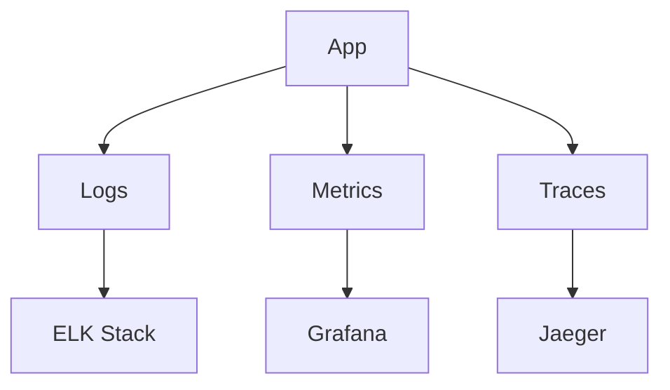

# Observability

## Overview
Ensures deep visibility across services using logs, metrics, and traces.

## Components
- **Logs** → ELK Stack
- **Metrics** → Prometheus + Grafana
- **Tracing** → OpenTelemetry + Jaeger

## Flow

