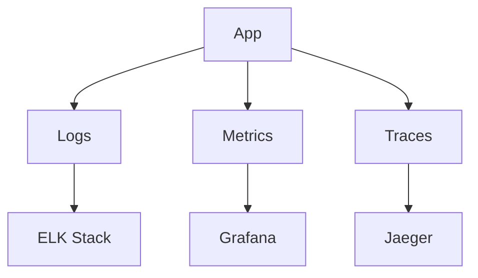

<!-- START doctoc generated TOC please keep comment here to allow auto update -->
<!-- DON'T EDIT THIS SECTION, INSTEAD RE-RUN doctoc TO UPDATE -->
## Table of Contents

- [Observability](#observability)
  - [Overview](#overview)
  - [Prerequisites](#prerequisites)
  - [Setup](#setup)
  - [Usage](#usage)
  - [References](#references)
  - [Overview](#overview-1)
  - [Components](#components)
  - [Flow](#flow)
  - [See Also](#see-also)
  - [Related Docs](#related-docs)

<!-- END doctoc generated TOC please keep comment here to allow auto update -->

# Observability

## Overview
- This section outlines the primary goals and scope of Observability.

## Prerequisites
- Familiarity with basic Observability concepts and system requirements is recommended.

## Setup
- Follow these steps to configure and enable Observability in your environment.

## Usage
- Instructions and examples for applying Observability in day-to-day operations.

## References
- Additional resources and documentation about Observability for further learning.

## Overview
Ensures deep visibility across services using logs, metrics, and traces.

## Components
- **Logs** → ELK Stack
- **Metrics** → Prometheus + Grafana
- **Tracing** → OpenTelemetry + Jaeger

## Flow

## See Also
- [Monitoring & Alerting Guide](MONITORING.md)
- [Monitoring Flow](MONITORING_FLOW.md)

## Related Docs
- [README.md](README.md)
- [MASTER_INDEX.md](MASTER_INDEX.md)

## Changelog
- Added Last Updated metadata

Last Updated: 2025-09-11 by ChatGPT
