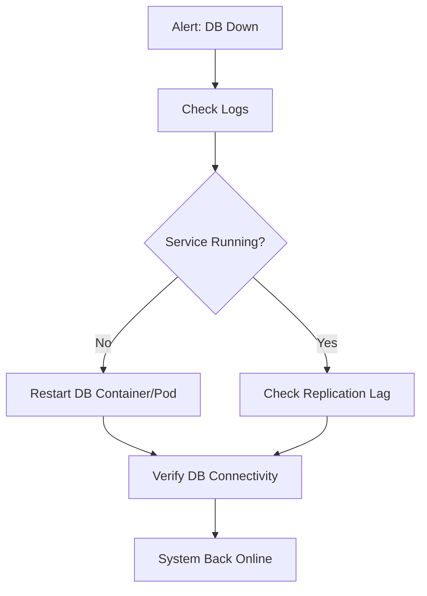
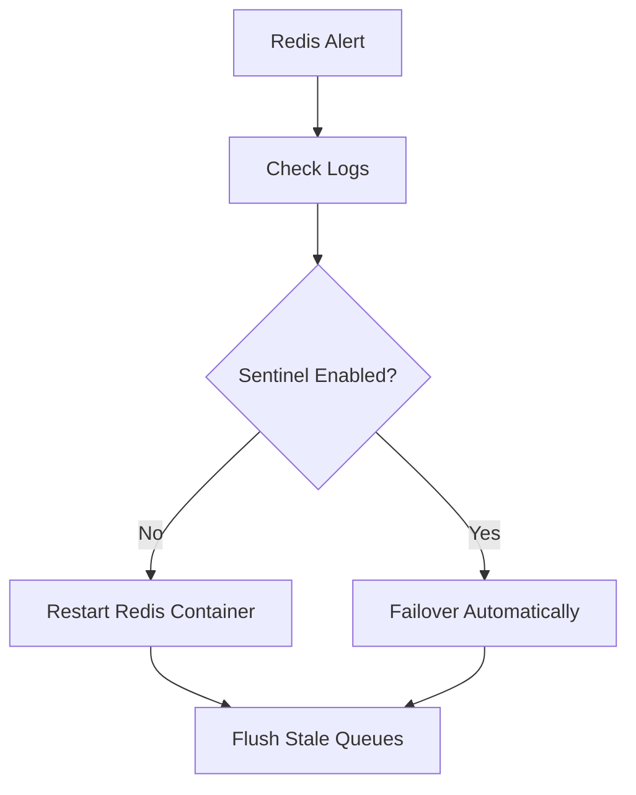
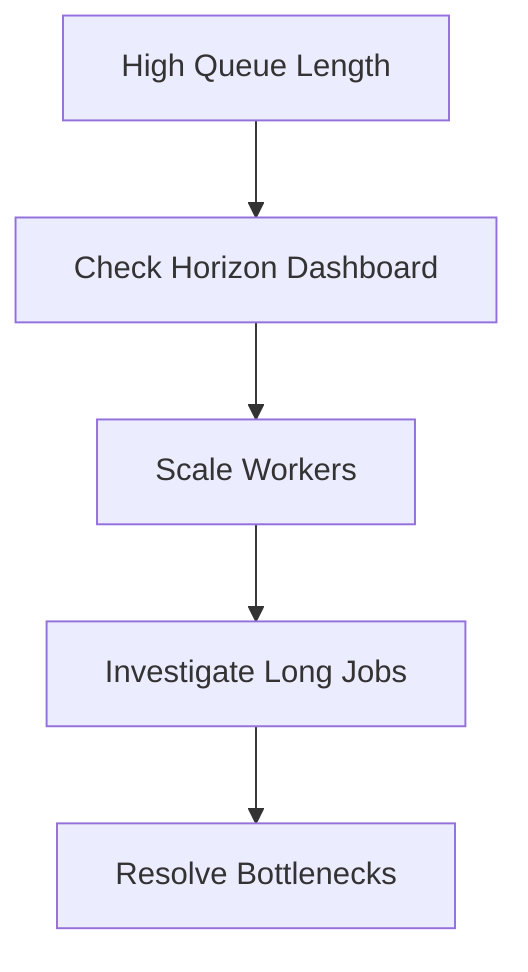
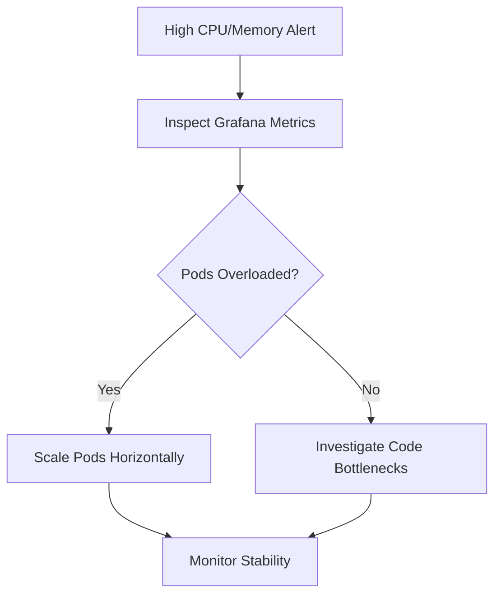

# Ops Playbook

## Overview
- This section outlines the primary goals and scope of Ops Playbook.

## Prerequisites
- Familiarity with basic Ops Playbook concepts and system requirements is recommended.

## Setup
- Follow these steps to configure and enable Ops Playbook in your environment.

## Usage
- Instructions and examples for applying Ops Playbook in day-to-day operations.

## References
- Additional resources and documentation about Ops Playbook for further learning.

## Database Outage

## Redis Crash

## Queue Backlog

## High CPU/Memory

## Related Docs
- [README.md](README.md)
- [MASTER_INDEX.md](MASTER_INDEX.md)

