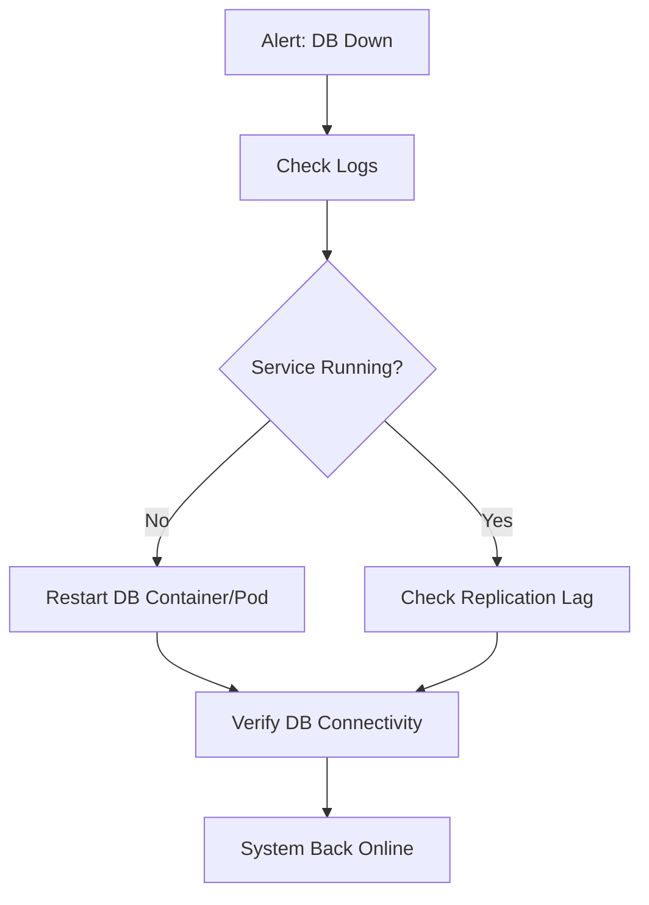
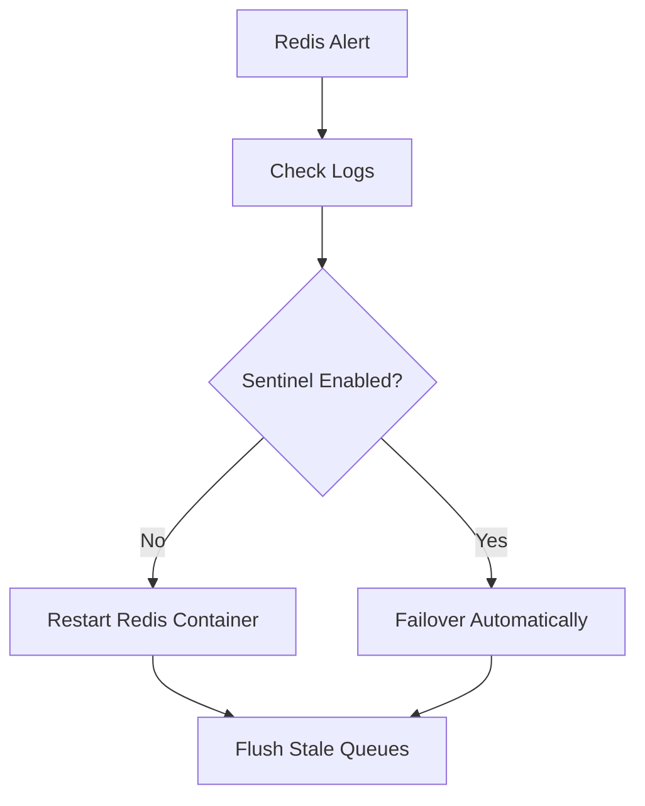
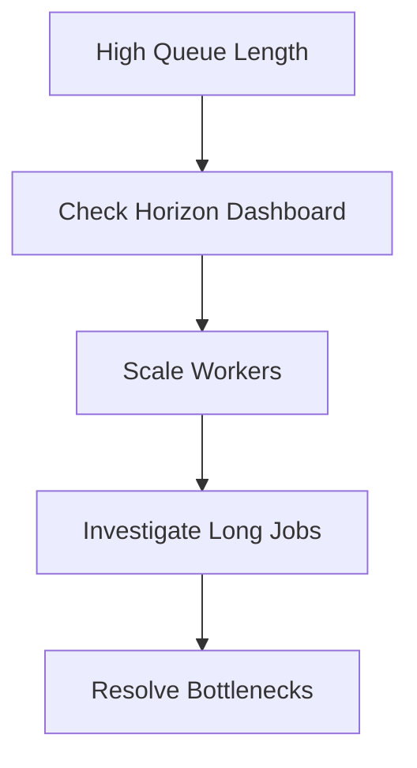
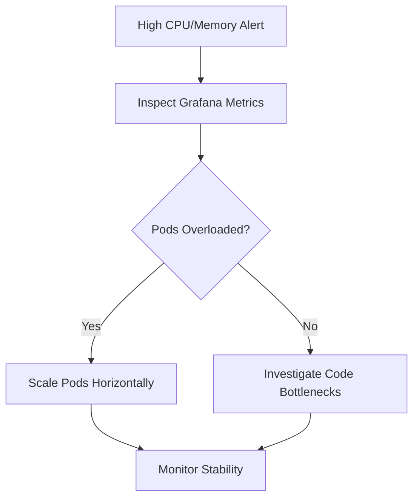

# Ops Playbook

## Overview
- TBD

## Prerequisites
- TBD

## Setup
- TBD

## Usage
- TBD

## References
- TBD

## Database Outage

```mermaid
flowchart TD
    A[Alert: DB Down] --> B[Check Logs]
    B --> C{Service Running?}
    C -- No --> D[Restart DB Container/Pod]
    C -- Yes --> E[Check Replication Lag]
    D --> F[Verify DB Connectivity]
    E --> F
    F --> G[System Back Online]
```

## Redis Crash

```mermaid
flowchart TD
    A[Redis Alert] --> B[Check Logs]
    B --> C{Sentinel Enabled?}
    C -- Yes --> D[Failover Automatically]
    C -- No --> E[Restart Redis Container]
    E --> F[Flush Stale Queues]
    D --> F
```

## Queue Backlog

```mermaid
flowchart TD
    A[High Queue Length] --> B[Check Horizon Dashboard]
    B --> C[Scale Workers]
    C --> D[Investigate Long Jobs]
    D --> E[Resolve Bottlenecks]
```

## High CPU/Memory

```mermaid
flowchart TD
    A[High CPU/Memory Alert] --> B[Inspect Grafana Metrics]
    B --> C{Pods Overloaded?}
    C -- Yes --> D[Scale Pods Horizontally]
    C -- No --> E[Investigate Code Bottlenecks]
    D --> F[Monitor Stability]
    E --> F
```
