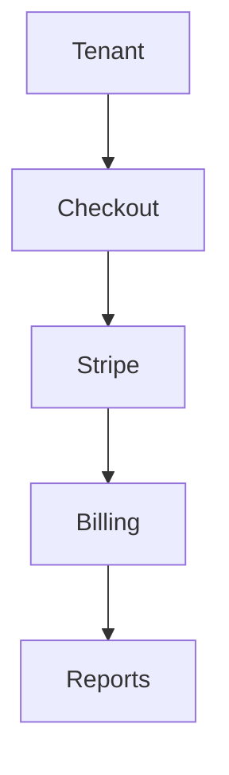

# Payments

## Overview
- This section outlines the primary goals and scope of Payments.

## Prerequisites
- Familiarity with basic Payments concepts and system requirements is recommended.

## Setup
- Follow these steps to configure and enable Payments in your environment.

## Usage
- Instructions and examples for applying Payments in day-to-day operations.

## References
- Additional resources and documentation about Payments for further learning.

## Overview
Handles all payment processing.

## Supported
- Stripe
- Paddle
- Offline bank transfers

## Features
- PCI DSS compliance
- Retry logic for failed payments
- Webhooks for payment events

## Flow

## Related Docs
- [README.md](README.md)
- [MASTER_INDEX.md](MASTER_INDEX.md)

## Changelog
- Added Last Updated metadata

Last Updated: 2025-09-11 by ChatGPT
