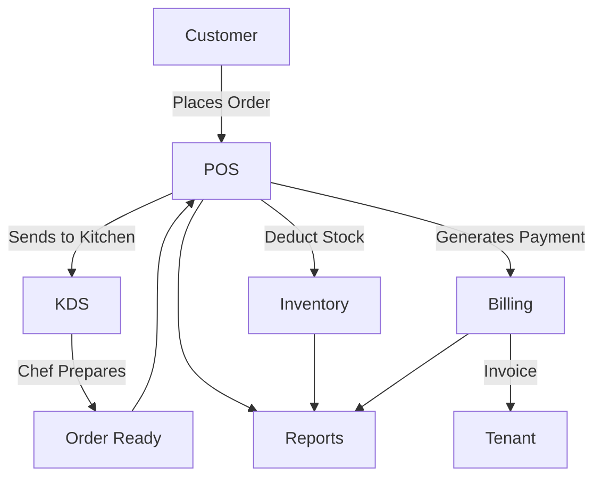

# POS Module

## Overview
- This section outlines the primary goals and scope of Pos.

## Prerequisites
- Familiarity with basic Pos concepts and system requirements is recommended.

## Setup
- Follow these steps to configure and enable Pos in your environment.

## Usage
- Instructions and examples for applying Pos in day-to-day operations.

## References
- Additional resources and documentation about Pos for further learning.


## Overview
Point of sale for processing orders, payments, and receipts.

## Features
- Supports dine-in, take-out, and delivery orders.  
- Handles discounts, tips, and tax calculations.  
- Synchronizes with inventory in real time.  

## End-to-End Workflow


## API
- `POST /api/pos/orders` – Create a new order.  

## Examples
```js
await axios.post('/api/pos/orders', {items: [...]});
```

## Security
- Tenant isolation for order data.  
- Role-based access for cashiers, waiters, managers.  

## Future Enhancements
- Offline mode with service workers.  
- Self-checkout mode.

## Related Docs
- [README.md](README.md)
- [MASTER_INDEX.md](MASTER_INDEX.md)

