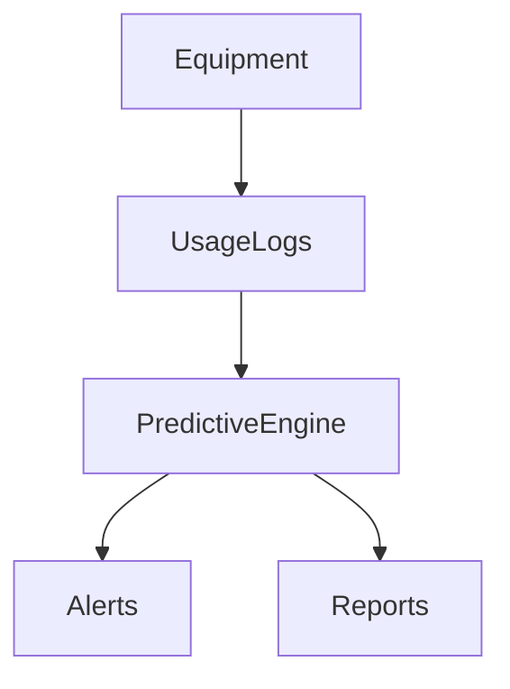

<!-- START doctoc generated TOC please keep comment here to allow auto update -->
<!-- DON'T EDIT THIS SECTION, INSTEAD RE-RUN doctoc TO UPDATE -->
## Table of Contents

- [Predictive Maintenance (Equipment)](#predictive-maintenance-equipment)
  - [Overview](#overview)
  - [Prerequisites](#prerequisites)
  - [Setup](#setup)
  - [Usage](#usage)
  - [References](#references)
  - [Overview](#overview-1)
  - [Features](#features)
  - [Flow](#flow)
  - [Related Docs](#related-docs)

<!-- END doctoc generated TOC please keep comment here to allow auto update -->

# Predictive Maintenance (Equipment)

## Overview
- This section outlines the primary goals and scope of Predictive Maintenance.

## Prerequisites
- Familiarity with basic Predictive Maintenance concepts and system requirements is recommended.

## Setup
- Follow these steps to configure and enable Predictive Maintenance in your environment.

## Usage
- Instructions and examples for applying Predictive Maintenance in day-to-day operations.

## References
- Additional resources and documentation about Predictive Maintenance for further learning.

## Overview
Predicts equipment failures using data patterns.

## Features
- Usage logging
- Maintenance scheduling
- AI-driven failure prediction
- Alerts for anomalies

## Flow

## Related Docs
- [README.md](README.md)
- [MASTER_INDEX.md](MASTER_INDEX.md)

