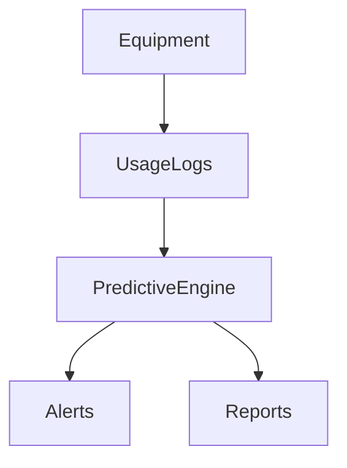

# Predictive Maintenance (Equipment)

## Overview
- TBD

## Prerequisites
- TBD

## Setup
- TBD

## Usage
- TBD

## References
- TBD

## Overview
Predicts equipment failures using data patterns.

## Features
- Usage logging
- Maintenance scheduling
- AI-driven failure prediction
- Alerts for anomalies

## Flow

