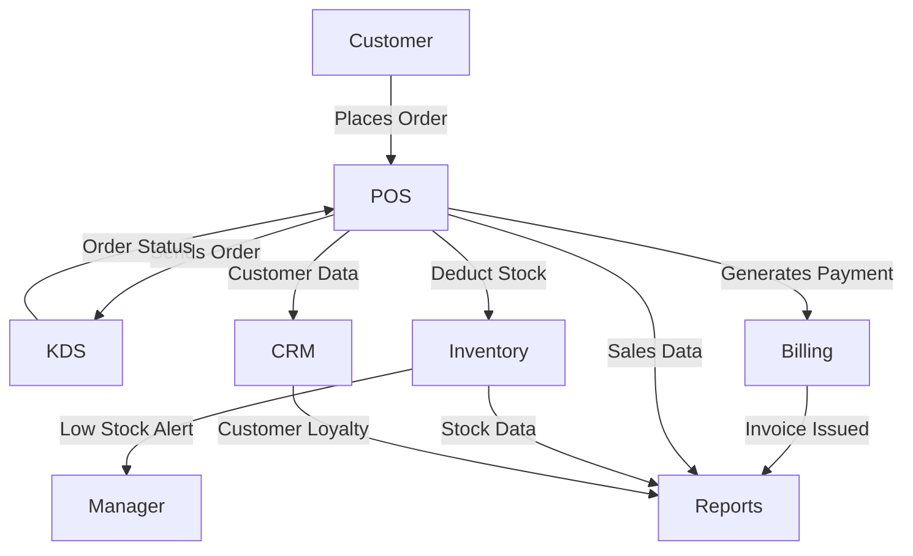

# Realtime Data Flow

## Overview
- TBD

## Prerequisites
- TBD

## Setup
- TBD

## Usage
- TBD

## References
- TBD

## Overview
This diagram illustrates the realtime interactions between modules during daily operations.  
Data flows through POS, Inventory, KDS, Billing, Reports, and CRM using WebSockets, Events, and Queues.

---

## Realtime Data Flow Diagram

---

## Key Notes
- **POS ↔ KDS**: Orders synced in realtime with WebSockets.  
- **POS ↔ Inventory**: Stock deducted instantly per order item.  
- **POS ↔ Billing**: Invoices generated per transaction.  
- **Reports** aggregates all data streams: Sales, Inventory, Billing, CRM.  
- **CRM** updates loyalty points and customer segmentation in realtime.  

---

## Technology
- **WebSockets (Pusher/Socket.IO)** → POS/KDS sync.  
- **Redis Pub/Sub** → Inventory and Billing events.  
- **Queue Workers (Horizon)** → async processing.  
