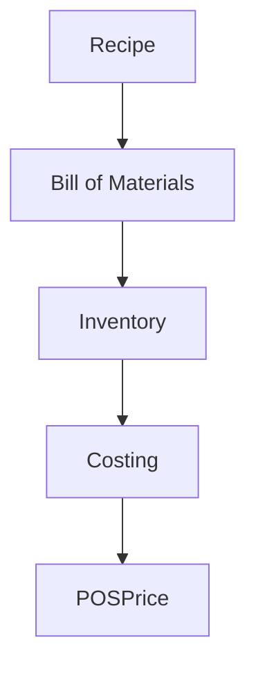

<!-- START doctoc generated TOC please keep comment here to allow auto update -->
<!-- DON'T EDIT THIS SECTION, INSTEAD RE-RUN doctoc TO UPDATE -->
## Table of Contents

- [Recipe Costing & BOM](#recipe-costing--bom)
  - [Overview](#overview)
  - [Prerequisites](#prerequisites)
  - [Setup](#setup)
  - [Usage](#usage)
  - [References](#references)
  - [Overview](#overview-1)
  - [Features](#features)
  - [Flow](#flow)
  - [Related Docs](#related-docs)

<!-- END doctoc generated TOC please keep comment here to allow auto update -->

# Recipe Costing & BOM

## Overview
- This section outlines the primary goals and scope of Recipe Costing.

## Prerequisites
- Familiarity with basic Recipe Costing concepts and system requirements is recommended.

## Setup
- Follow these steps to configure and enable Recipe Costing in your environment.

## Usage
- Instructions and examples for applying Recipe Costing in day-to-day operations.

## References
- Additional resources and documentation about Recipe Costing for further learning.

## Overview
Defines cost calculation for recipes and menu items.

## Features
- Bill of Materials (BOM)
- Auto-deduct ingredients from inventory
- Calculate cost per serving
- Profit margin analysis

## Flow

## Related Docs
- [README.md](README.md)
- [MASTER_INDEX.md](MASTER_INDEX.md)

## Changelog
- Added Last Updated metadata

Last Updated: 2025-09-11 by ChatGPT
