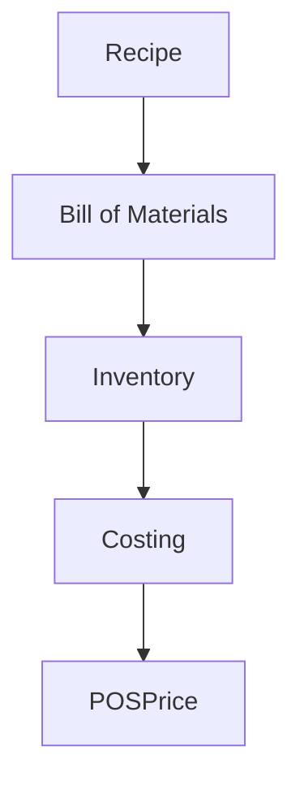

# Recipe Costing & BOM

## Overview
- TBD

## Prerequisites
- TBD

## Setup
- TBD

## Usage
- TBD

## References
- TBD

## Overview
Defines cost calculation for recipes and menu items.

## Features
- Bill of Materials (BOM)
- Auto-deduct ingredients from inventory
- Calculate cost per serving
- Profit margin analysis

## Flow

