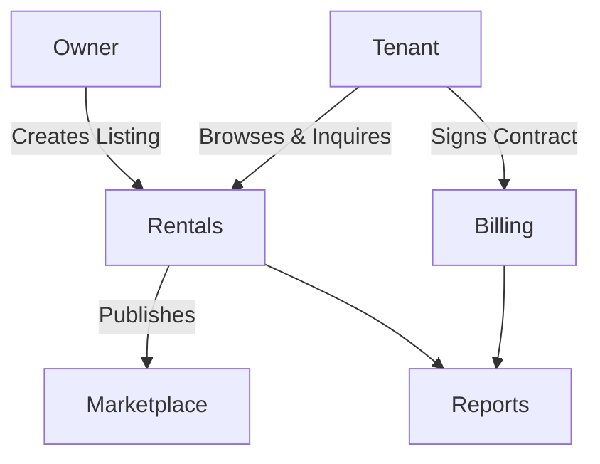

# Rentals Module

## Overview
- TBD

## Prerequisites
- TBD

## Setup
- TBD

## Usage
- TBD

## References
- TBD

## Overview
Manages listings for cafes/restaurants available for rent or sale.

## Features
- Create and manage rental/sale listings.  
- Tenants can browse and inquire.  
- Integration with Billing for payments.  
- Reporting on rental activities.  

## Workflow

## API
- `GET /api/rentals/listings` – List available rentals.  
- `POST /api/rentals/listings` – Create listing.  
- `POST /api/rentals/contract` – Sign rental contract.  

## Security
- Owner verification (KYC).  
- Contract data secured and auditable.  

## Future Enhancements
- Smart contracts on blockchain.  
- Dynamic pricing algorithms.  
