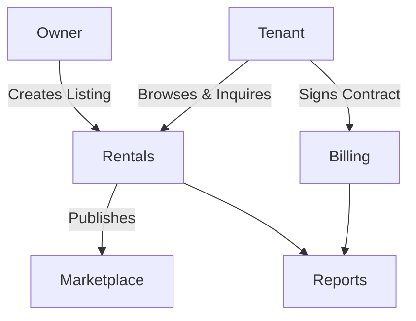

# Rentals Module

## Overview
- This section outlines the primary goals and scope of Rentals.

## Prerequisites
- Familiarity with basic Rentals concepts and system requirements is recommended.

## Setup
- Follow these steps to configure and enable Rentals in your environment.

## Usage
- Instructions and examples for applying Rentals in day-to-day operations.

## References
- Additional resources and documentation about Rentals for further learning.

## Overview
Manages listings for cafes/restaurants available for rent or sale.

## Features
- Create and manage rental/sale listings.  
- Tenants can browse and inquire.  
- Integration with Billing for payments.  
- Reporting on rental activities.  

## Workflow

## API
- `GET /api/rentals/listings` – List available rentals.  
- `POST /api/rentals/listings` – Create listing.  
- `POST /api/rentals/contract` – Sign rental contract.  

## Security
- Owner verification (KYC).  
- Contract data secured and auditable.  

## Future Enhancements
- Smart contracts on blockchain.  
- Dynamic pricing algorithms.

## Related Docs
- [README.md](README.md)
- [MASTER_INDEX.md](MASTER_INDEX.md)

## Changelog
- Added Last Updated metadata

Last Updated: 2025-09-11 by ChatGPT
