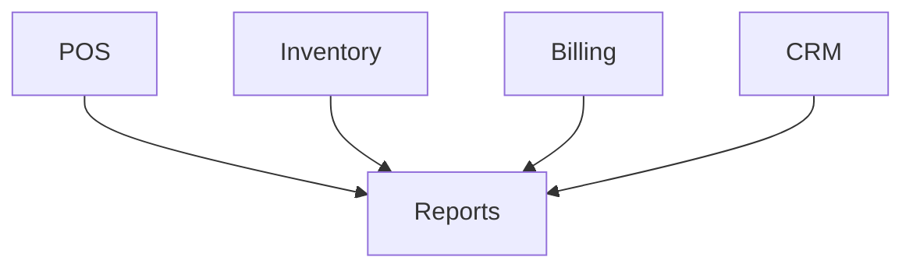

# Reports Module

## Overview
- This section outlines the primary goals and scope of Reports.

## Prerequisites
- Familiarity with basic Reports concepts and system requirements is recommended.

## Setup
- Follow these steps to configure and enable Reports in your environment.

## Usage
- Instructions and examples for applying Reports in day-to-day operations.

## References
- Additional resources and documentation about Reports for further learning.

## Overview
Aggregates data from POS, Inventory, Billing, CRM.

## Features
- Sales reports
- Inventory usage reports
- Customer activity reports
- Financial statements

## Exports
- PDF, Excel, CSV

## Flow

## Related Docs
- [README.md](README.md)
- [MASTER_INDEX.md](MASTER_INDEX.md)

## Changelog
- Added Last Updated metadata

Last Updated: 2025-09-11 by ChatGPT
