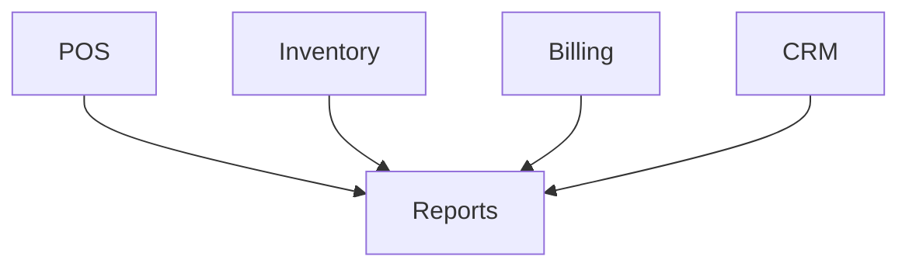

# Reports Module

## Overview
- TBD

## Prerequisites
- TBD

## Setup
- TBD

## Usage
- TBD

## References
- TBD

## Overview
Aggregates data from POS, Inventory, Billing, CRM.

## Features
- Sales reports
- Inventory usage reports
- Customer activity reports
- Financial statements

## Exports
- PDF, Excel, CSV

## Flow

