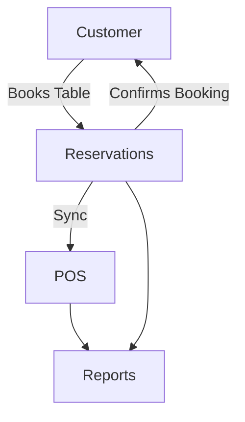

# Reservations Module

## Overview
- This section outlines the primary goals and scope of Reservations.

## Prerequisites
- Familiarity with basic Reservations concepts and system requirements is recommended.

## Setup
- Follow these steps to configure and enable Reservations in your environment.

## Usage
- Instructions and examples for applying Reservations in day-to-day operations.

## References
- Additional resources and documentation about Reservations for further learning.

## Overview
Handles table booking and reservation management for restaurants and cafes.

## Features
- Customers can reserve tables online or via staff.  
- Integration with POS for order handling.  
- Manage availability and cancellations.  
- Generate reservation reports.  

## Workflow

## API
- `POST /api/reservations` – Create reservation.  
- `GET /api/reservations` – List reservations.  
- `DELETE /api/reservations/{id}` – Cancel reservation.  

## Security
- Role-based access (staff, managers).  
- Tenant isolation for reservation data.  

## Future Enhancements
- Online deposit payments.  
- AI-based table allocation optimization.

## Related Docs
- [README.md](README.md)
- [MASTER_INDEX.md](MASTER_INDEX.md)

