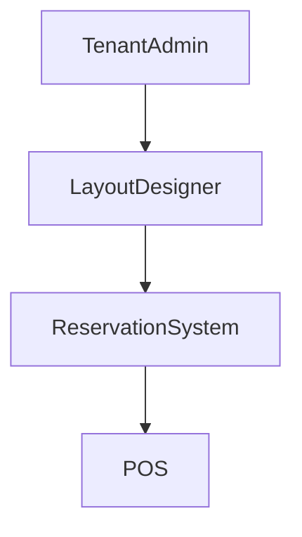

# Reservation Layout

## Overview
- This section outlines the primary goals and scope of Reservation Layout.

## Prerequisites
- Familiarity with basic Reservation Layout concepts and system requirements is recommended.

## Setup
- Follow these steps to configure and enable Reservation Layout in your environment.

## Usage
- Instructions and examples for applying Reservation Layout in day-to-day operations.

## References
- Additional resources and documentation about Reservation Layout for further learning.

## Overview
Defines table layout UI for reservations.

## Features
- Drag-and-drop table placement
- Zone mapping (indoor, outdoor, VIP)
- Real-time availability view

## Flow

## Related Docs
- [README.md](README.md)
- [MASTER_INDEX.md](MASTER_INDEX.md)

