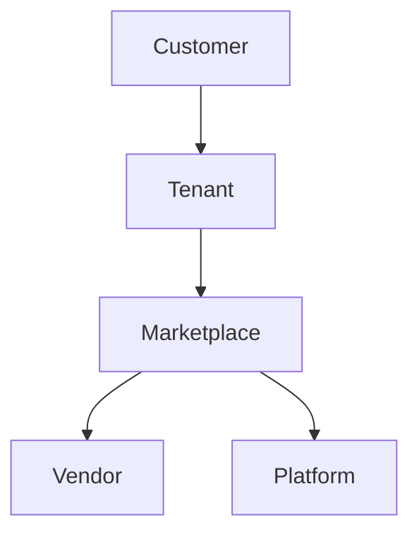

# Marketplace Revenue Share

## Overview
- This section outlines the primary goals and scope of Revenue Share.

## Prerequisites
- Familiarity with basic Revenue Share concepts and system requirements is recommended.

## Setup
- Follow these steps to configure and enable Revenue Share in your environment.

## Usage
- Instructions and examples for applying Revenue Share in day-to-day operations.

## References
- Additional resources and documentation about Revenue Share for further learning.

## Overview
Explains how vendor plugin revenue is calculated and shared.

## Rules
- Default split: 80% Vendor, 20% Platform.
- Adjustable per contract.
- Automated billing via Billing module.

## Flow

## Related Docs
- [README.md](README.md)
- [MASTER_INDEX.md](MASTER_INDEX.md)

## Changelog
- Added Last Updated metadata

Last Updated: 2025-09-11 by ChatGPT
