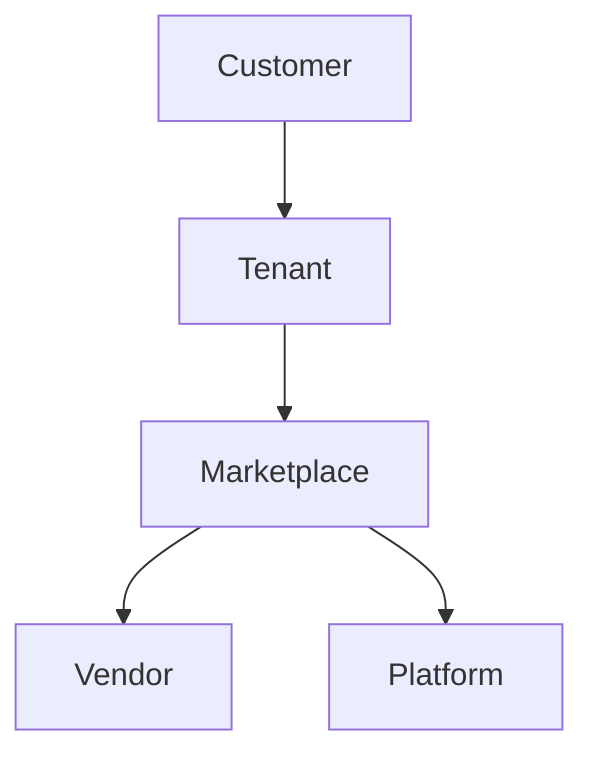

# Marketplace Revenue Share

## Overview
Explains how vendor plugin revenue is calculated and shared.

## Rules
- Default split: 80% Vendor, 20% Platform.
- Adjustable per contract.
- Automated billing via Billing module.

## Flow

