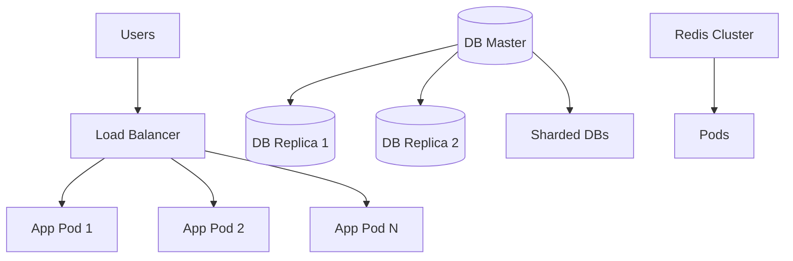

# Scaling Flow

## Overview
- This section outlines the primary goals and scope of Scaling Flow.

## Prerequisites
- Familiarity with basic Scaling Flow concepts and system requirements is recommended.

## Setup
- Follow these steps to configure and enable Scaling Flow in your environment.

## Usage
- Instructions and examples for applying Scaling Flow in day-to-day operations.

## References
- Additional resources and documentation about Scaling Flow for further learning.

## Overview
Illustrates how the platform scales horizontally and vertically.

## Flow Diagram

## Notes
- Horizontal scaling with Kubernetes pods.
- DB replication and sharding.
- Redis cluster for caching and queues.
- Multi-region failover with DNS load balancing.

## Related Docs
- [README.md](README.md)
- [MASTER_INDEX.md](MASTER_INDEX.md)

