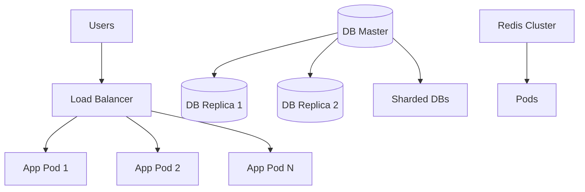

# Scaling Flow

## Overview
- TBD

## Prerequisites
- TBD

## Setup
- TBD

## Usage
- TBD

## References
- TBD

## Overview
Illustrates how the platform scales horizontally and vertically.

## Flow Diagram

## Notes
- Horizontal scaling with Kubernetes pods.
- DB replication and sharding.
- Redis cluster for caching and queues.
- Multi-region failover with DNS load balancing.
